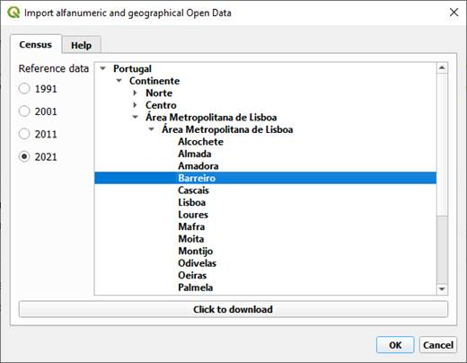

# Plugin downloadGeostatPortugal 

## Description
This QGIS plugin called downloadGeoStatPortugal, was developed to allow greater accessibility to geography and the main alphanumeric data of the Censuses, and can be found in the QGIS plugins repository.

## Instructions

To download the data, select the desired year and in the tree click on a geographic unit (Portugal, Mainland, Region: NUTS-II, Sub-region: NUTS-III or a municipality); then click the “click to download” button and the data will be added to **QGIS**.

    

This is open data published in geopackage format (.gpkg).